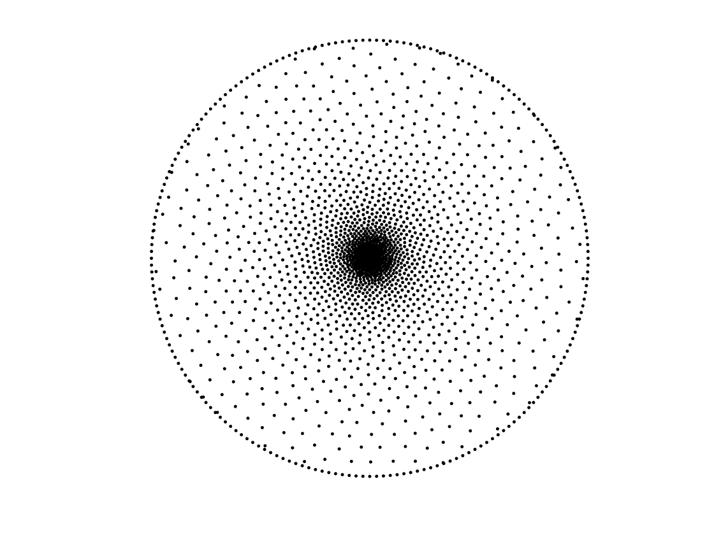
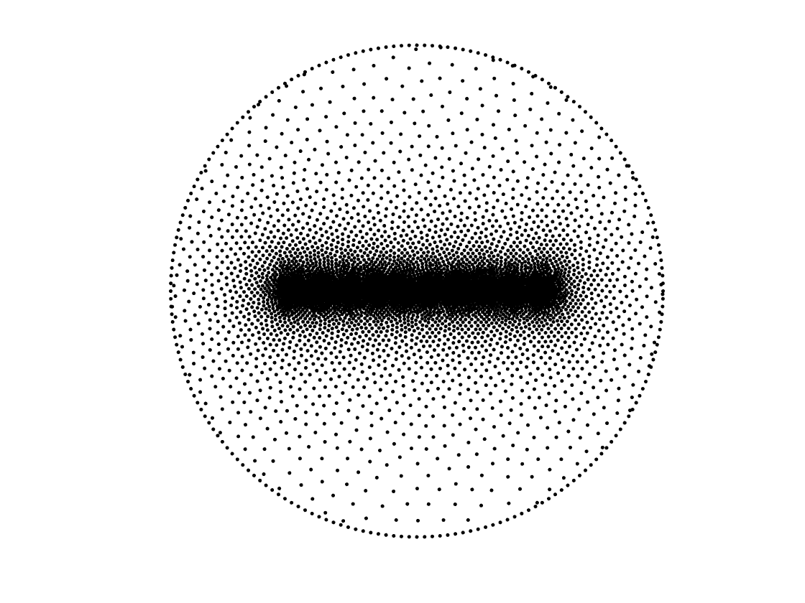
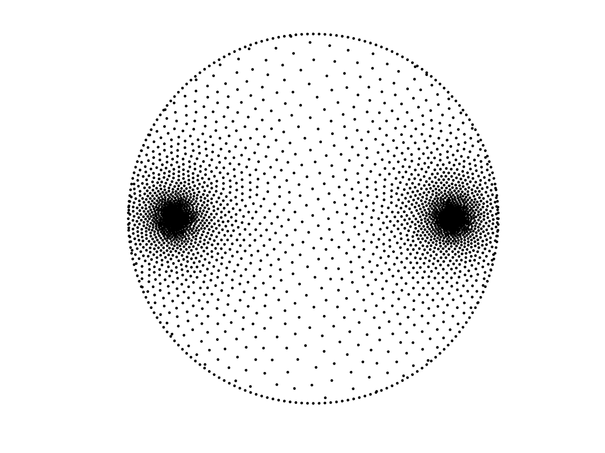
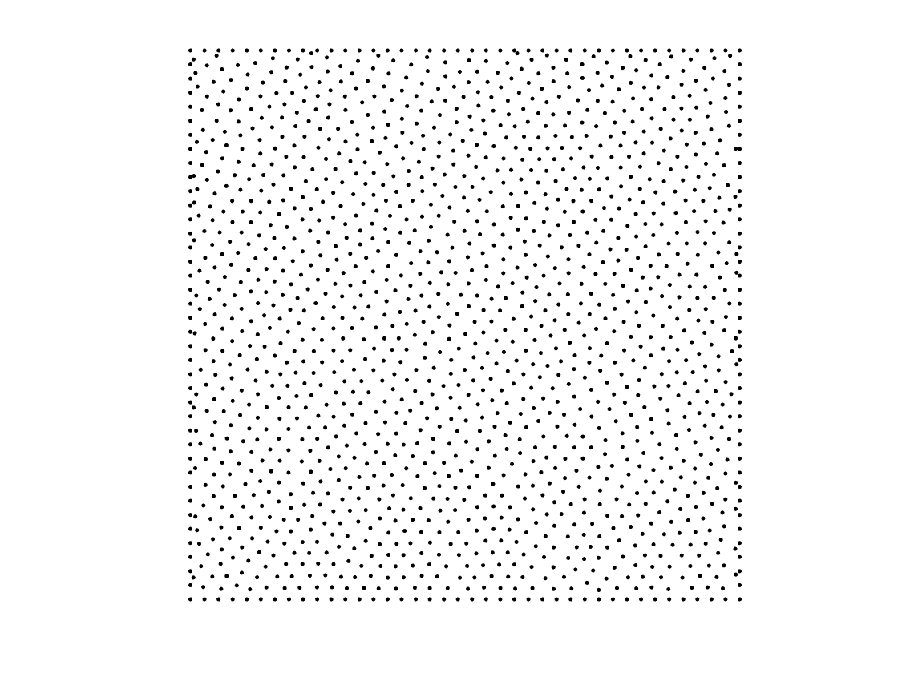
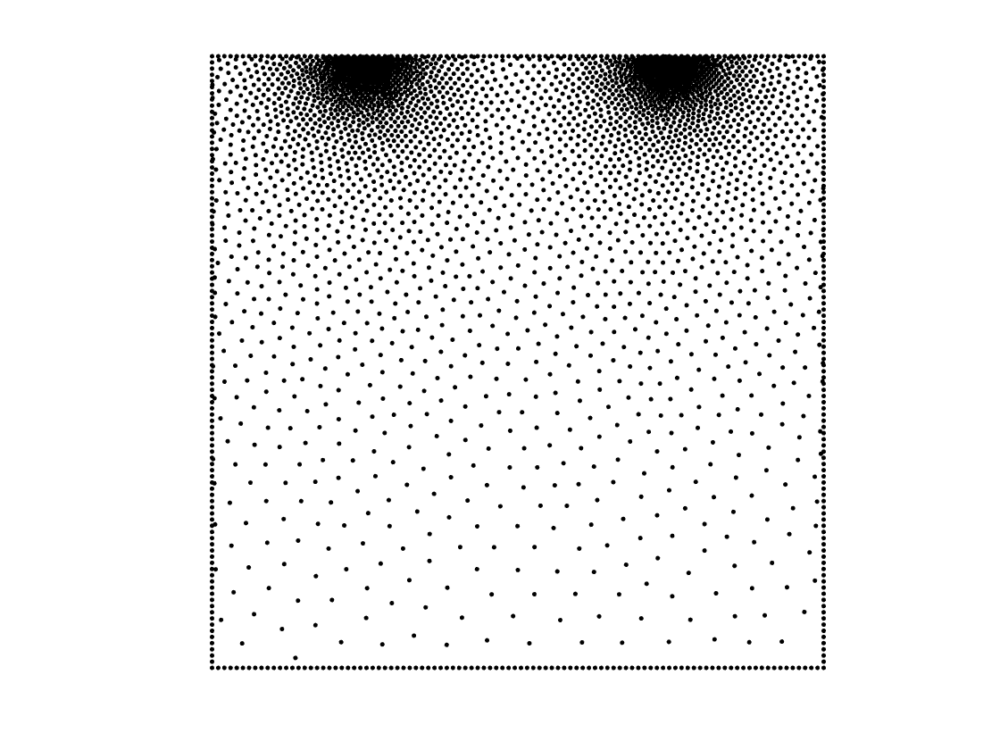
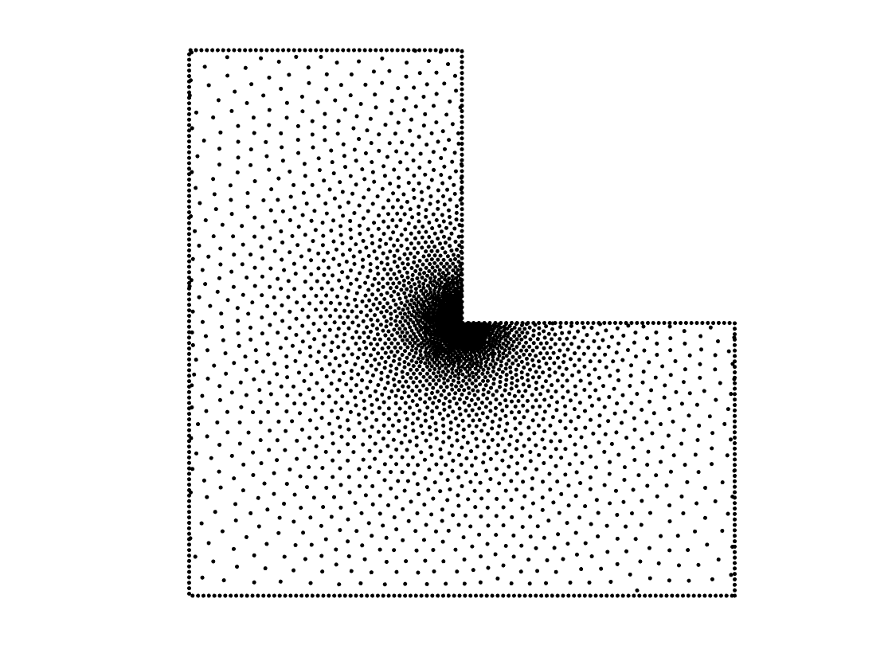
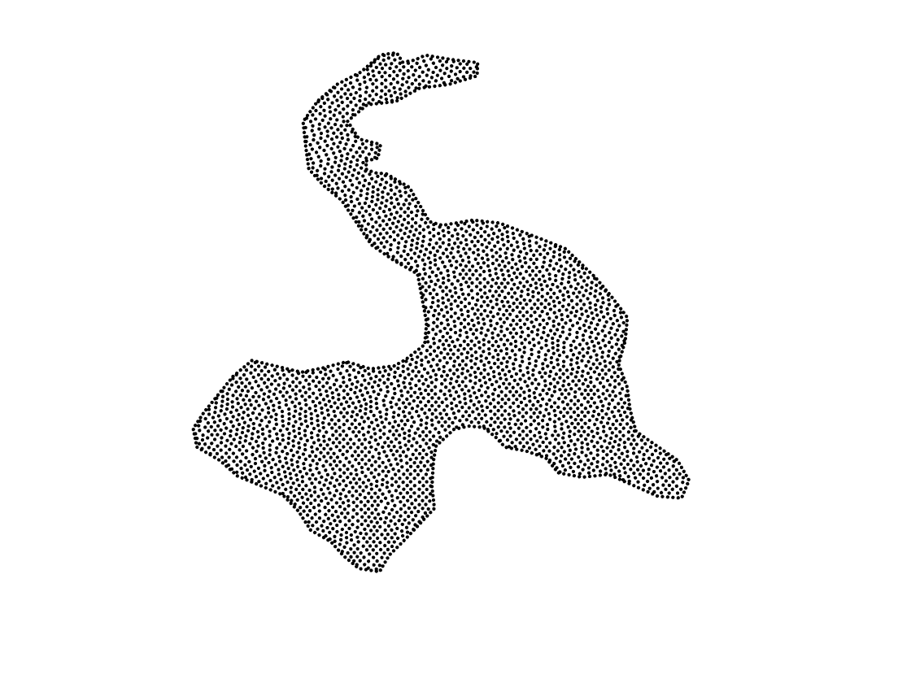
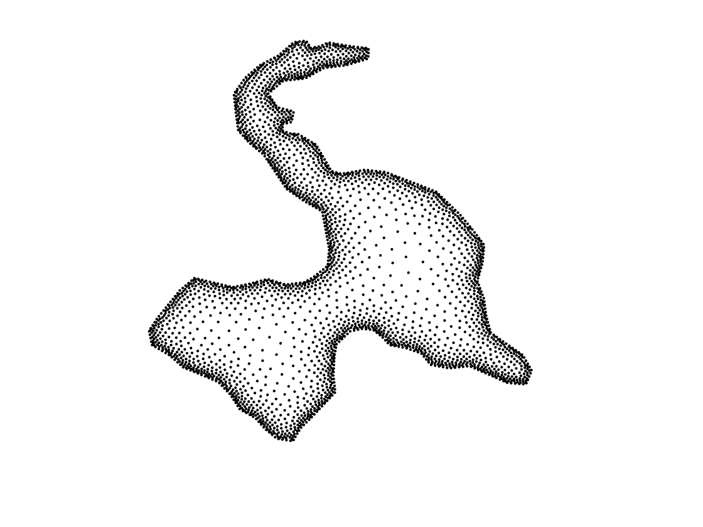
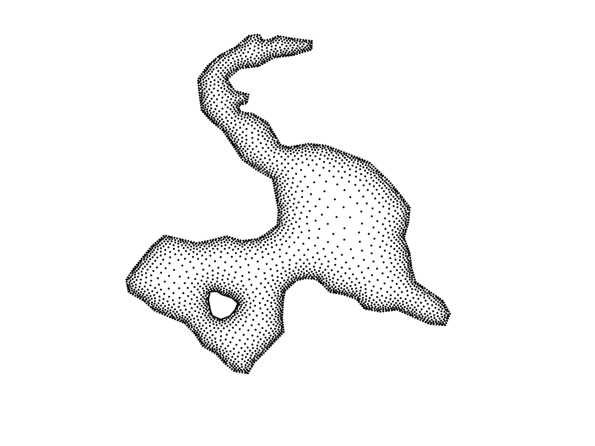

## NodeLab
NodeLab is a simple MATLAB-package for unstructured node-generation and refinement for meshfree modeling in 2D arbitrary domains. The final output can be seen in the 'workspace'. Following are the description of Input/Output variables of NodeLab:
### Input: 
  * *box* - a vector defining the bounding box of the domain.
  * *hbdy* - the density of the boundary poit-cloud
  * *ptol* - minimum distance between two nodes
  * *ctps* - control-points for density variation 
  * *radius* - distance function for node density metric 
### Output
  * *xy* — an array containing interior nodes.
  * *bdy*— an array containing boundary nodes. 

## Installation
* Download the package on your PC. 
* Open MATLAB
* Go to the directory 'NodeLab'
* run the script 'setup.m'. This will add different directories of the NodeLab on your MATLAB path — only for the current session. Now you are ready to run the demos and generate nodes for your own project. 

## Tutorials
## 1.1
Generate nodes inside a circle within a bounding box (-1,1)^2 with no control points.
```matlab
clear varibale; close all; clc
box    = [-1,-1; 1,1];
hbdy   = 0.02;
ptol   = 0.001;
[b]    = draw_circ(0,0,1,2/hbdy);
ctps   = [];
%ctps   = [linspace(-0.5, 0.5,10); zeros(1,10)]';        
radius = @(p,ctps) 0.05; % for fixed node-density
%radius = @(p,ctps) 0.005+0.08*(min(pdist2(ctps, p))); % for variable node-density
[xy]   = NodeLab2D(b.sdf,box,ctps,ptol, radius);
[bdy]  = b.xy;
clear box hbdy ptol ctps radius b
%-------------------------------------
plot(xy(:,1), xy(:,2),'.k','MarkerSize',12)
hold on
plot(bdy(:,1), bdy(:,2), '.k','MarkerSize',12)
axis('square'); set(gca,'visible','off') 
```


## 1.2
Generate nodes inside a circle within a bounding box (-1,1)^2 but keep a varibale-density being highest at the single control point (0,0).
```matlab
clear varibale; close all; clc
box    = [-1,-1; 1,1];
hbdy   = 0.02;
ptol   = 0.001;
[b]    = draw_circ(0,0,1,2/hbdy);
ctps   = [0, 0];
radius = @(p,ctps) 0.005+0.08*(min(pdist2(ctps, p))); % for variable node-density
[xy]   = NodeLab2D(b.sdf,box,ctps,ptol, radius);
[bdy]  = b.xy;
clear box hbdy ptol ctps radius b
%-------------------------------------
plot(xy(:,1), xy(:,2),'.k','MarkerSize',12)
hold on
plot(bdy(:,1), bdy(:,2), '.k','MarkerSize',12)
axis('square'); set(gca,'visible','off')
```


## 1.3
Generate nodes inside a circle within a bounding box (-1,1)^2 but keep a varibale-density being highest along a line between (-0.75,0) and (0.75,0).
```matlab
%-----------------------------------
clear varibale; close all; clc
box    = [-1,-1; 1,1];
hbdy   = 0.02;
ptol   = 0.001;
[b]    = draw_circ(0,0,1,2/hbdy);
%ctps   = [0, 0];
ctps   = [linspace(-0.5, 0.5,10); zeros(1,10)]';        
%radius = @(p,ctps) 0.05; % for fixed node-density
radius = @(p,ctps) 0.005+0.08*(min(pdist2(ctps, p))); % for variable node-density
[xy]   = NodeLab2D(b.sdf,box,ctps,ptol, radius);
[bdy]  = b.xy;
clear box hbdy ptol ctps radius b
%-------------------------------------
plot(xy(:,1), xy(:,2),'.k','MarkerSize',12)
hold on
plot(bdy(:,1), bdy(:,2), '.k','MarkerSize',12)
axis('square'); set(gca,'visible','off')
```


## 1.4 
Generate nodes inside a circle within a bounding box (-1,1)^2 but keep a varibale-density being highest along two seperate points: (-0.75,0), and (0.75,0).
```matlab
%-----------------------------------
clear varibale; close all; clc
box    = [-1,-1; 1,1];
hbdy   = 0.02;
ptol   = 0.001;
[b]    = draw_circ(0,0,1,2/hbdy);
ctps   = [-0.75,0; 0.75,0];
radius = @(p,ctps) 0.005+0.08*(min(pdist2(ctps, p))); 
[xy]   = NodeLab2D(b.sdf,box,ctps,ptol, radius);
[bdy]  = b.xy;
clear box hbdy ptol ctps radius b
%-------------------------------------
plot(xy(:,1), xy(:,2),'.k','MarkerSize',12)
hold on
plot(bdy(:,1), bdy(:,2), '.k','MarkerSize',12)
axis('square'); set(gca,'visible','off')
```


## 2.1
Generate nodes in a rectangle within a bounding box (-1,1)^2. 
```matlab
clear variables; close all; clc
%------------------------------------------------
box    = [-1,-1; 1,1];
hbdy   = 0.05;
ptol   = 0.01;
ctps   = [];
radius = @(p, ctps) 0.05;
[b]    = draw_rect(-1,-1,1,1,2/hbdy);
[xy]   = NodeLab2D(b.sdf,box,ctps,ptol,radius);
[bdy]  = b.xy;
clear box hbdy ptol ctps radius b
%---------------------------------------------------
plot(xy(:,1), xy(:,2),'.k','MarkerSize',12);hold on
plot(bdy(:,1), bdy(:,2), '.k','MarkerSize',12); axis('square')
set(gca,'visible','off')
```


## 2.2 
Generate nodes in a rectangle within a bounding box (-1,1)^2. Make varibale density at two point-source. 
```matlab 
% unit circle
clear variables; close all; clc
%------------------------------------------------
box    = [-1,-1; 1,1];
hbdy   = 0.02;
ptol   = 0.001;
ctps   = [-0.5,1; 0.5, 1];
radius = @(p,ctps) 0.005+0.05*(min(pdist2(ctps, p)));
[b]    = draw_rect(-1,-1,1,1,2/hbdy);
[xy]   = NodeLab2D(b.sdf,box,ctps,ptol,radius);
[bdy]  = b.xy;
clear box hbdy ptol ctps radius b
%---------------------------------------------------
plot(xy(:,1), xy(:,2),'.k','MarkerSize',12);hold on
plot(bdy(:,1), bdy(:,2), '.k','MarkerSize',12); axis('square')
set(gca,'visible','off')
```


## 2.3 
Generate nodes in a L-shape domain for point-singularity problems.
```matlab
clear variables; close all; clc
%----------------------------------------------------
box    = [-1, -1; 1, 1 ];
hbdy   = 0.025;
ptol   = 0.001;
[b]    = make_domain('Lshape.txt'); 
ctps   = [0, 0];
radius = @(p,ctps) 0.005+0.05*(min(pdist2(ctps, p)));
[xy]   = NodeLab2D(b.sdf,box,ctps,ptol,radius);
bdy    = bsmooth(b.xy, hbdy);
clear b box hbdy ctps radius ptol 
%----------------------------------------------------- 
plot(xy(:,1), xy(:,2),'.k','MarkerSize',12); hold on
plot(bdy(:,1), bdy(:,2), '.k','MarkerSize', 12); axis('square')
set(gca,'visible','off')
```



## 3.1 
Generate nodes in  a Island model.  
```matlab 
clear variables; close all; clc
%--------------------------------------------
box  = [100.0, 145.0; 634.0, 799.0 ];
hbdy = 5; 
ptol = 1;
[b]  = make_domain('lake.txt'); % process lake points as boundary
[bdy] = bsmooth(b.xy, hbdy);
ctps  = bdy;
radius = @(p,ctps) 6 ; 
[xy]  = NodeLab2D(b.sdf,box,ctps,ptol,radius);
%--------------------------------------------
plot(xy(:,1), xy(:,2),'.k','MarkerSize',10); hold on
plot(bdy(:,1), bdy(:,2), '.k','MarkerSize', 10); axis('square')
set(gca,'visible','off')
``` 
 

## 3.2 

Generate nodes in  a Island model. Variable-density being maximum at the boundary.   
```matlab 
clear variables; close all; clc
%--------------------------------------------
box  = [100.0, 145.0; 634.0, 799.0 ];
hbdy = 5; 
ptol = 1;
[b]  = make_domain('lake.txt'); % process lake points as boundary
[bdy] = bsmooth(b.xy, hbdy);
ctps  = bdy;
radius = @(p,ctps) 6 ; 
[xy]  = NodeLab2D(b.sdf,box,ctps,ptol,radius);
%--------------------------------------------
plot(xy(:,1), xy(:,2),'.k','MarkerSize',10); hold on
plot(bdy(:,1), bdy(:,2), '.k','MarkerSize', 10); axis('square')
set(gca,'visible','off')
``` 
 

## 3.3 
Generate nodes in  a Island model having a small lake inside it.  Varibale-density being maximum at each boundaries. 
```matlab
% unit circle
clear variables; close all; clc
%-----------------------------------------
box  = [100.0, 145.0; 634.0, 799.0 ];
hbdy = 3; 
ptol = 1;
[b1]  = make_domain('lake.txt'); % process lake points as boundary
[b2]  = make_domain('island.txt');
b.sdf = @(p) max(b1.sdf(p), -b2.sdf(p)) ;
b1.xy = bsmooth(b1.xy, hbdy);
b2.xy = bsmooth(b2.xy, hbdy);
b.xy = [b1.xy; b2.xy];
ctps = b.xy;
radius = @(p,ctps) 2 + 0.2*(min(pdist2(ctps, p)));
[x]  = NodeLab2D(b.sdf,box,ctps,ptol,radius);
%-----------------------------------------
plot(x(:,1), x(:,2),'.k','MarkerSize',8); hold on
plot(b.xy(:,1), b.xy(:,2), '.k','MarkerSize', 8); axis('square');
set(gca,'visible','off')
``` 
 

